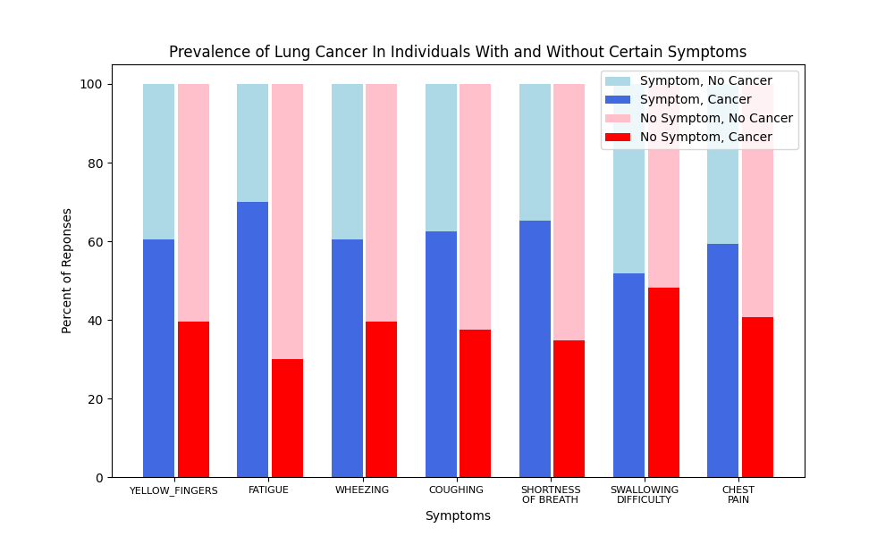
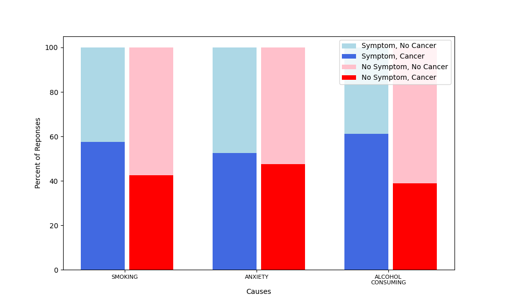

# Lung Cancer Data Analysis and Model
This study uses lung cancer survey data from [@mysarahmadbhat](https://www.kaggle.com/datasets/mysarahmadbhat/lung-cancer) on Kaggle. A short analysis of the effects of different symptoms is done.

## Analysis
The analysis will aim to determine the most important factors when determining the presence of lung cancer in an individual from the survey. 

### Symptoms

Below is a graph showing, for each 'symptom' of lung cancer, the percent of those who had cancer and the symptom, and the percent of those who had cancer and didn't have the symptom. 

As you can see, the greatest difference between symptom relevance is for fatigue. Because the percent of those who had cancer when having fatigue was much greater than the percent of those who had cancer when not having fatigue, one can assume that fatigue is one of the most significant symptoms of lung cancer. 

In contrast, cancer seems to be equally prevalant among those with or without shortness of breath, indicating that the symptom is not a very good indicator of cancer (if someone has or doesn't have it, they are about equally likely to have lung cancer).

___

### Causes

There was also an analysis on different causes that could lead to cancer. The graph is shown below.

The cause with the highest difference is alcohol consumption; about 63% of those who did consume alcohol had lung cancer, while about 40% of those who didn't consume alcohol had lung cancer. This indicates that, out of the survey respondents, the most relevant cause seemed to be alcohol consumption. On that note, smoking also seemed to be a big cause for lung cancer. However, anxiety seems to have no effect.